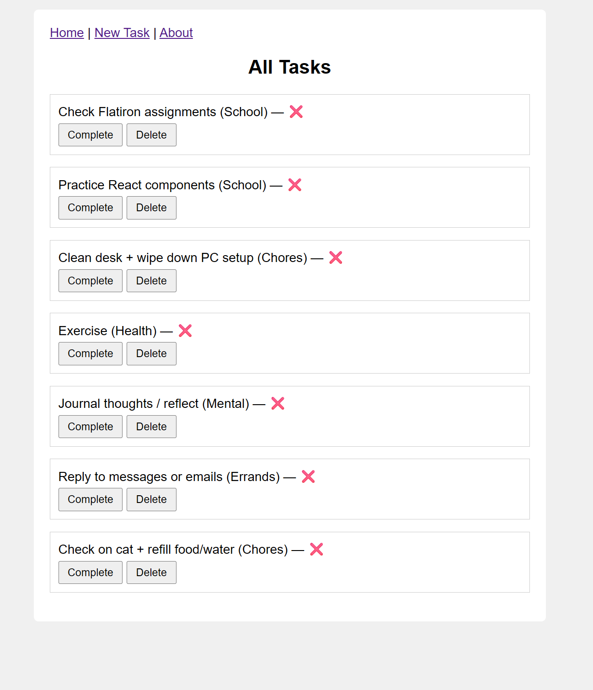

# Task Manager Web App

Welcome to my Task Manager app — a simple web app built with React that helps organize your daily responsibilities. I built this app to keep track of everyday tasks like schoolwork, health goals, errands, or mental resets — all in one place. It’s meant to be lightweight, easy to use, and clean-looking.

## Features

- Add Tasks: Submit new tasks using a form (with title and category).
- Mark Complete: Press a button to mark a task as done ✅.
- Delete Task: Remove tasks once you're finished or no longer need them.
- Organized Layout: Tasks are aligned clearly, with buttons vertically stacked.

## Screenshot



## Task Management

1. **Add a Task**: Go to "New Task", fill out the form with the task title and choose a category (like Health, School, Chores, etc.).

2. **Mark as Complete**: Once a task is done, click “Complete” and it’ll turn into a ✅ symbol.

3. **Delete a Task**: Click the Delete button to remove any task from your list.

## Setup and Installation

### Step 1: Clone the Repositories

This app uses two repos — one for the frontend and one for the backend (json-server).

**Frontend**
```bash
git clone git@github.com:YOUR_USERNAME/task-manager-frontend.git
```

**Backend**
```bash
git clone git@github.com:YOUR_USERNAME/task-manager-backend.git
```

Replace `YOUR_USERNAME` with your GitHub username or the repo owner.

### Step 2: Install and Start json-server

**1.** Navigate into the backend folder:
```bash
cd task-manager-backend
```

**2.** Make sure you have `json-server` installed:
```bash
npm install -g json-server
```

**3.** Run the server:
```bash
json-server --watch db.json --port 6001
```

Your tasks will be saved to and fetched from `http://localhost:6001/tasks`.

### Step 3: Start the React Frontend

**1.** Open a new terminal and go into the frontend folder:
```bash
cd task-manager-frontend
```

**2.** Install dependencies:
```bash
npm install
```

**3.** Start the React dev server:
```bash
npm start
```

### Step 4: Use the App

Once both servers are running:
- Go to `http://localhost:3000`
- Start adding, completing, and deleting tasks!

## Tools & Tech Used

- **React**: Frontend component-based framework
- **JavaScript**: Logic and interaction
- **CSS**: Simple styling and layout
- **json-server**: Local backend for persisting tasks

## File Structure Overview

```plaintext
task-manager-frontend/
├── src/
│   ├── App.js
│   ├── NavBar.js
│   ├── TaskList.js
│   ├── NewTaskForm.js
│   └── About.js

task-manager-backend/
├── db.json
```

## Devices

This app was built on **Linux (WSL)** using **VS Code**. It runs in modern desktop browsers. No mobile styling is included.

## License

```MIT License
Copyright (c) 2025 Isaiah Mitchell

Permission is hereby granted, free of charge, to any person obtaining a copy
of this software... (yes, you’ve seen this part before)

Don't steal this or I'll be mad.  
And I’ll know.  
(ง •̀ᗝ•́)ง
```